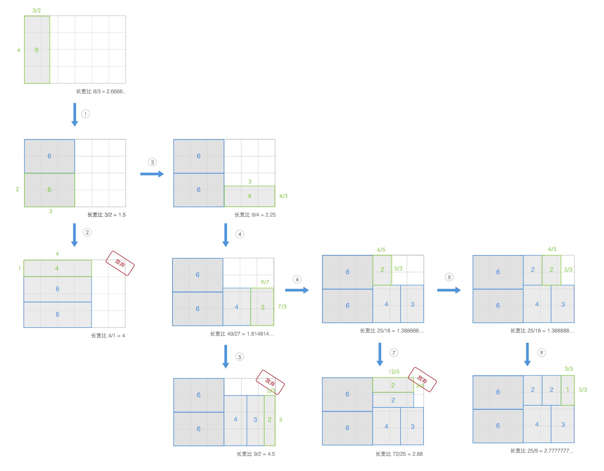
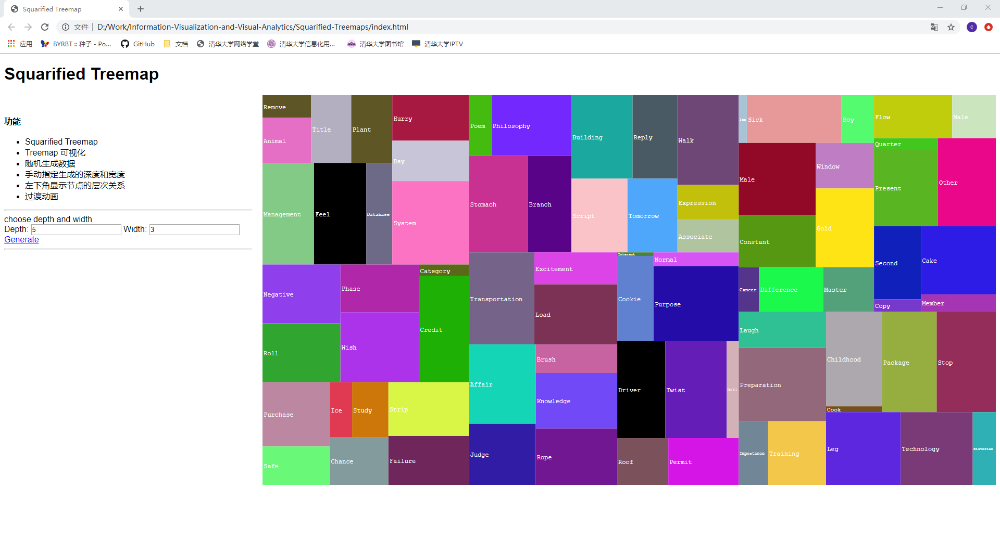

# Squarified Treemaps 算法实现

- 实现Squarified Treemaps算法
- 对treemap进行可视化
- 可以自定义深度和宽度
- 自动生成数据
- 过渡动画

## 算法原理

主要的工作是复现了"Squarified Treemaps"中的算法。

算法的总体思想是使生成的图形接近正方形，在每一步计算当中计算最新放置矩形的长宽比，长宽比越接近1则越接近正方形，当长宽比偏离1时，应放弃当前插入的位置，重新寻找下一个插入的位置。

在这里借用知乎上的一张图片很清晰的展示了算法执行的过程。



利用递归的思想，按照水平和垂直的方向排列矩形，排列时根据是否会改善当前的长宽比，来决定要么将矩形添加到当前行，要么固定当前行，在剩余的子矩形中添加新的行。

程序的伪代码如下：

```
procedure squarify(list of real children, list of real row, real w)
begin
    real c = head(children);
    if worst(row, w) <= worst(row++[c], w) then
        squarify(tail(children), row++[c], w)
    else
        layoutrow(row);
        squarify(children, [], width());
end
```

其中,width()返回给出当前所在行的其余子矩形的最短边的长度。

layoutrow()在矩形中添加新的子行。

worst()返回矩形列表中的最高长宽比。

## 实验效果



## 参考资料

1. Bruls, Mark, Kees Huizing, and Jarke J. Van Wijk. Squarified treemaps." In Data Visualization 2000, pp. 33-42. Springer, Vienna, 2000.
2. 来，认识一下这个数据可视化中的90后：Treemap - Xhinking的文章 - 知乎
https://zhuanlan.zhihu.com/p/19894525
